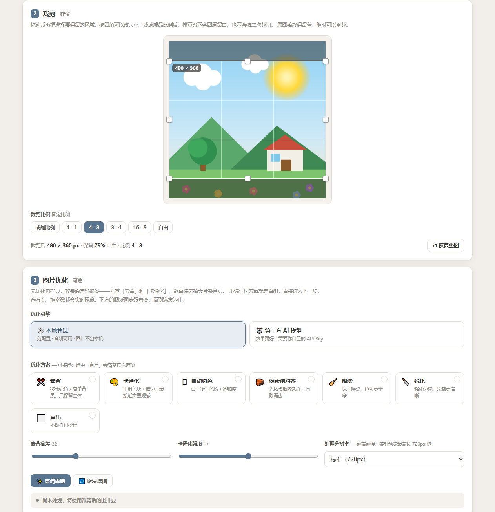
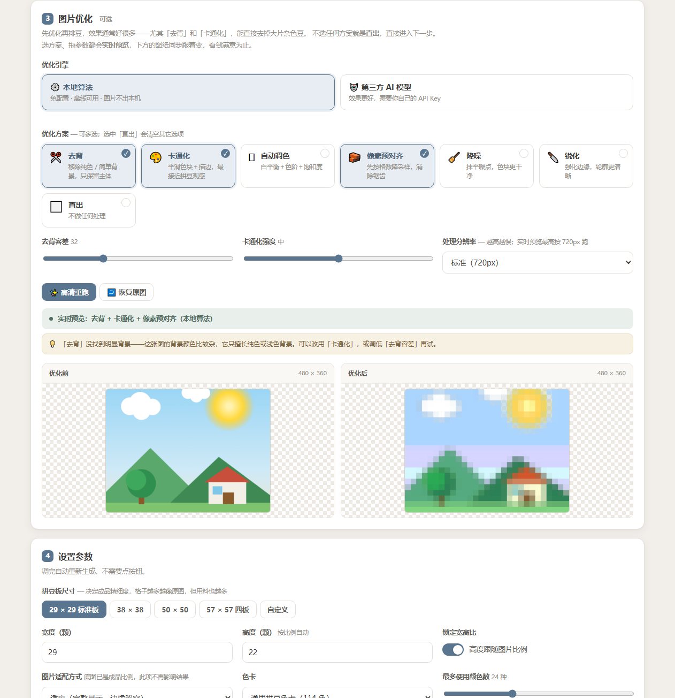
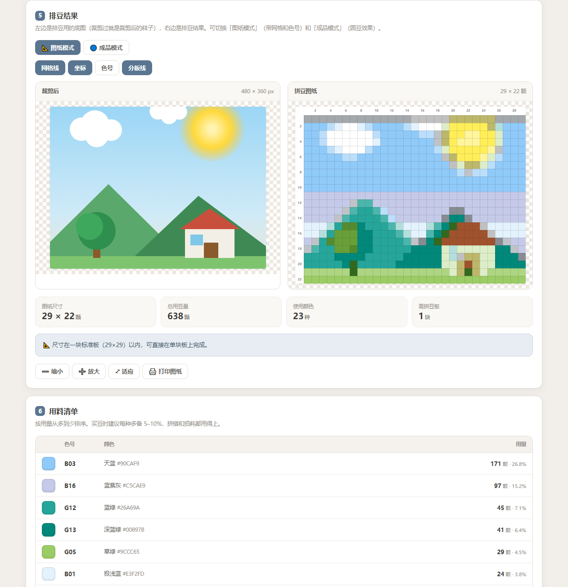

# 拼豆图案生成器

把一张照片自动排成**拼豆图纸**的纯网页工具。

### **[→ 在线使用](https://perler-bead-pattern.2412.workers.dev)**

单文件、零依赖、纯前端。**照片只在你自己的浏览器里处理，不会上传到任何服务器。**

---

## 它能做什么

| 步骤 | 说明 |
|---|---|
| **1 选图** | 点击、拖拽或直接 Ctrl+V 粘贴，也支持手机拍照 |
| **2 裁剪** | 拖动裁剪框选保留区域，比例默认跟随成品尺寸 |
| **3 图片优化**（可选） | 去背、卡通化、自动调色、像素预对齐、降噪、锐化；勾选即实时预览 |
| **4 设置参数** | 图纸尺寸、色卡、限色数、抖动、背景剔除 |
| **5 排豆结果** | 图纸模式（带网格和色号）/ 成品模式（圆豆效果） |
| **6 用料清单** | 每种颜色的用量与建议备量，导出 PNG 图纸或 CSV |

### 裁剪



拖动裁剪框选择保留区域，拖四角改大小。裁成**成品比例**后，排豆既不会四周留白，也不会被二次裁切。原图始终保留着，随时可以重裁。

### 图片优化 · 实时预览



选方案、拖参数都会**实时预览**，不用反复点按钮等结果。想要全分辨率就点「高清重跑」。

第三方 AI 引擎**不会跟着勾选自动调用** —— 它花的是你自己的 API 额度，必须显式点按钮。

### 排豆结果



---

## 几个实现上的取舍

这个项目里有几处不那么显然的决定，记下来免得以后自己也想不通。

**裁剪独立于优化，原图永不改动。** 排豆实际吃的是「底图」（原图裁剪后的结果），优化再在底图上做。这样「恢复原图」不会把裁剪一起抹掉，重裁也不用重新选图。

**裁剪框存归一化坐标，所有路径都过同一个收敛函数。** 拖拽、切比例、改成品尺寸全都产出一个「期望矩形」，再交给 `legalCropRect` 统一收敛：比例精确、不越界、不小于最小边长。比例锁死后只剩一个自由度，拿高度当变量、宽度由比例推出，比分别 clamp 宽高再互相纠偏干净得多。

**导入时的顺序不能反。** 必须先让高度跟随原图比例，再按成品比例立裁剪框。反过来的话成品比例还是上一张图留下的，新图一进来就会被莫名裁掉一块。由此得到一个舒服的性质：**默认导入不裁**，只有显式把成品定成别的比例时才真的裁。

**双边滤波是唯一的性能瓶颈，先量再改。** 实测 720px 要 522ms，其余各步都不到 50ms。把核权重从盒装对象数组改成扁平化定型数组、给「核不会越界」的内部矩形开快路径、LUT 下标用乘法代替除法之后：

| 分辨率 | 优化前 | 优化后 |
|---|---|---|
| 720px | 522ms | **259ms** |
| 1000px | 1019ms | **416ms** |

**实时预览靠防抖 + 竞态令牌。** 150ms 防抖；每次运行带一个单调递增的令牌，结果落地前比对，过期结果直接丢弃。再加一个 `yieldToPaint()` 强制浏览器先把「预览中」画出来再开始同步重活，否则状态条根本来不及渲染，看起来像卡死。

**「像素预对齐」是消除锯齿最有效的一招。** 先把图落到网格尺寸，再最近邻放大回去，保证每个格子拿到的是「一个确定的颜色」而不是几十个像素的平均。

**没有路由，所以不用 SPA 回落。** 站点是单页且不分 history / hash 路由，`not_found_handling` 用 `404-page`。用 SPA 回落会让任意乱输的路径都返回 200 + 首页内容，被搜索引擎当成无限多份重复页面收录。

---

## 本地运行

不需要构建，也不需要装依赖 —— 直接用浏览器打开 `index.html` 就能用。

想跑本地服务器（能复刻线上同样的响应头规则）：

```bash
npm install
npm run dev            # wrangler dev，默认 http://localhost:8787
```

---

## 测试

`.e2e/` 下是 **173 项端到端断言**，跑在真实的 Chrome 上，零依赖
（通过 Chrome DevTools Protocol 驱动，用 Node 22+ 内置的 `WebSocket`）。

```bash
npm test               # 两个套件依次跑
node .e2e/test.js      # 核心功能 80 项
node .e2e/test-opt.js  # 图片优化 93 项
```

覆盖：排豆算法数值验证、尺寸与宽高比、裁剪交互（真实 PointerEvent 拖拽）、
三种适配方式、去背、色卡解析、导出 CSV/PNG 的字节级校验、移动端 390px 无溢出、
以及**性能护栏**（720px 双边滤波 < 420ms，防止以后改坏实时预览的前提）。

`.e2e/capture.js` 是整页视觉走查脚本，改完 UI 跑一次就能重新生成截图。

---

## 部署

跑在 Cloudflare Workers 静态资源上，配置只有 `wrangler.jsonc` 一个文件。

```bash
npx wrangler login
npm run deploy
```

⚠️ 注意 `wrangler.jsonc` 里的 `assets.exclude` **是无效字段** —— wrangler 只会打印一句
warning 然后照样把整个目录传上去。排除必须靠根目录的 `.assetsignore`，而且
**注释只能独占一行**（`#` 只有出现在行首才是注释，写成 `.git/  # 说明` 会把整行当成
模式，结果什么都匹配不到）。想确认到底会上传什么：

```bash
WRANGLER_LOG=debug npx wrangler deploy --dry-run 2>&1 | grep "Ignoring asset:"
```

---

## 兼容性

需要支持 `Pointer Events`、`Canvas 2D`、`createImageBitmap` 的现代浏览器
（Chrome / Edge / Safari / Firefox 近两年版本）。

---

## 许可

MIT
